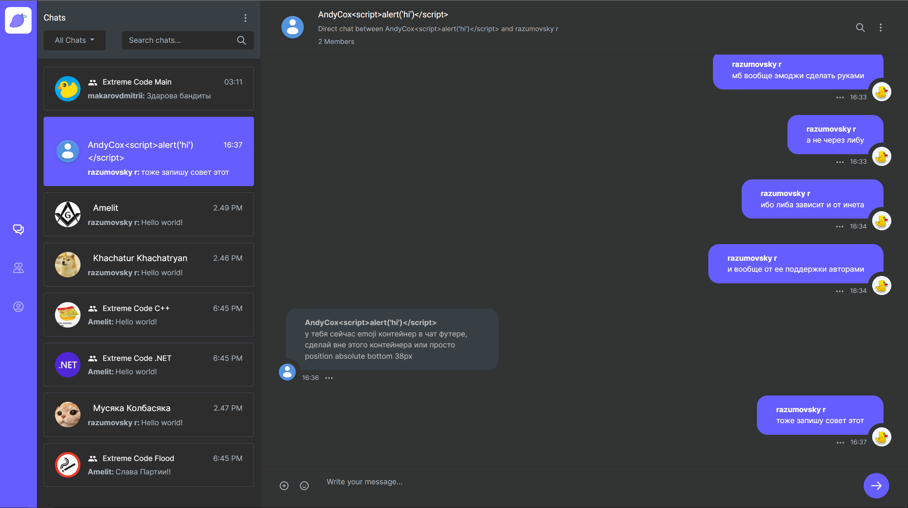
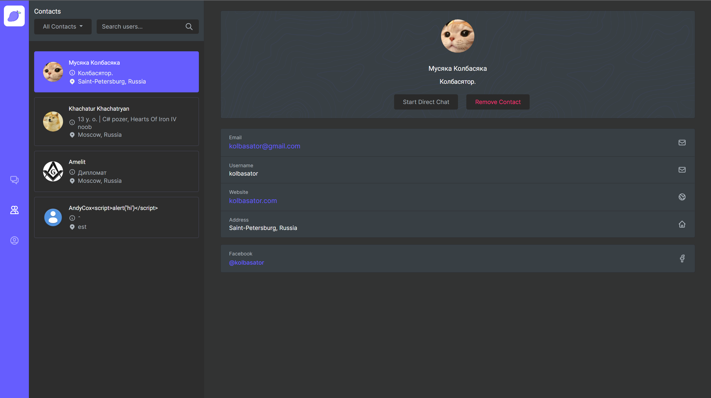
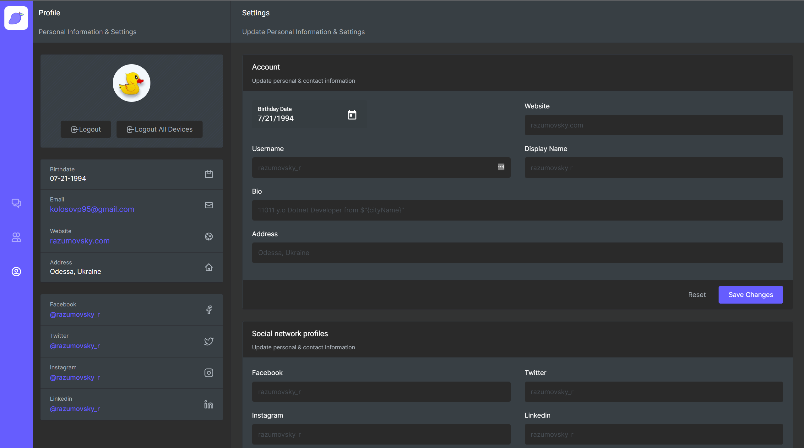

# Mango Messenger Angular Frontend

  </img>

## What is all about

Mango Messenger is an opensource instant messaging system such that implemented using ASP NET 5 framework as REST API
backend along with Angular framework as frontend. In general, current project is considered to be a diploma project in
order to get bachelor's degree of computer science. However, now it is considered to be a just example of ASP .NET Core
API implementation using best practices in terms of architecture etc, where it is possible to apply different software
development approaches and to see how it works on different environments such as Azure, Heroku etc. Moreover, a few
cryptographical concepts are implemented such as DH key exchange that can be applied in order to implement secret chats
in feature. Current frontend implementation has three basic components:

- **Main**: component responsible for files and messages exchange

  </img>

- **Contacts**: component responsible for contacts management

  </img>

- **Personal setting**: component responsible for user information management

  </img>

## Build and run locally

Perform the following steps:

- Install NVM: https://github.com/coreybutler/nvm-windows
- Install Node JS 14.17.3 via NVM: `nvm install 14.17.3`
- Use Node JS 14.17.3 via NVM: `nvm use 14.17.3`
- Check Node JS installed properly: `node -v`
- Fork this repository
- Clone forked repository locally: `git clone https://github.com/${{ username }}/MangoMessengerFrontend.git`
- Go to the project folder
- Restore packages: `npm ci`
- Install Angular CLI globally: `npm install -g @angular/cli@11.2.7`
- Check that Angular CLI installed properly: `ng version`
- Run project: `ng serve`

## Build and run in docker

- Build image: `docker build -t 1337322420/mango-angular-frontend:0.0.1 .`
- Run container: `docker run -d -p 9080:80 --name mango_frontend 1337322420/mango-angular-frontend:0.0.1`

## Build and run desktop version using ElectronJS

- `ng build --base-href ./ && electron .`
- Electron guide: https://buddy.works/tutorials/building-a-desktop-app-with-electron-and-angular

## Environments

Current project is deployed to the four environments as follows:

- Azure Dev: https://front.mangomessenger.company (domain valid till 28-Oct-2022)
- Azure QA: https://front.mangomesenger.company (domain valid till 28-Oct-2022)
- Heroku: https://messenger-mango.herokuapp.com
- GitHub Pages: https://razumovskii.github.io

## Workflows

- Azure Dev. Branch: `azure-dev` based on `develop`, workflow started after merge with actual `develop`. Consumes
  backend: https://back.mangomessenger.company
- Azure QA. Branch: `azure-qa` based on `develop`, workflow started after merge with actual `develop`. Consumes
  backend: https://back.mangomesenger.company
- Heroku. Branch: `master` workflow started after actual `develop` merged to `master`. Consumes
  backend: https://mango-messenger-app.herokuapp.com
- Git pages. Branch: `github-pages` based on `develop`, workflow started after merge with actual `develop`. Consumes
  backend: https://back.mangomessenger.company

As image below shows

## Tasks management

The opened tasks and issues to be organized an handled as follows:

- Each task has an assigned number in the format `MANGO-UI-ID`
- Active tasks are available on the Trello board: https://trello.com/b/DAmYVOmn/mango-frontend-trello
- Each task branch is based on the actual `develop` branch and pull requested there on complete
- Branch `develop` then merged to `azure-dev`, `azure-qa`, `github-pages`, `master` branches on particular milestone
  complete

## Git flow

Version control to be organized as follows:

- Fork this repository
- Clone this repository using `git clone https://github.com/${{ username }}/MangoMessengerFrontend.git`
- If repository is cloned already then pull last changes from `develop` using
  - `git checkout develop`
  - `git pull`
- Create new branch based on `develop` with name according to `MANGO-UI-ID` of the task
- Solve the task
- Create pull request to `develop`

## Commit messages

- In case of bug fix, example of commit message `bugfix: some bug fixed`
- In case of feature, example of commit message `feature: some new functionality added`
- In case of refactor, example of commit message `refactor: some code part refactored`

## Logo Attribution

Icons made by <a href="https://www.freepik.com" title="Freepik">Freepik</a> from <a href="https://www.flaticon.com/" title="Flaticon">www.flaticon.com</a>

